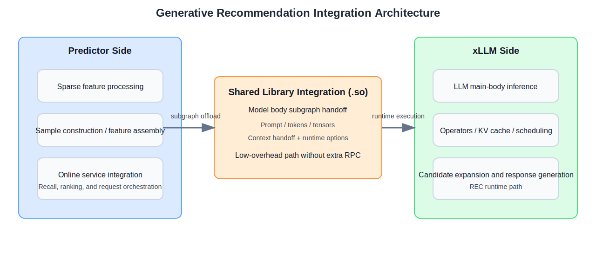
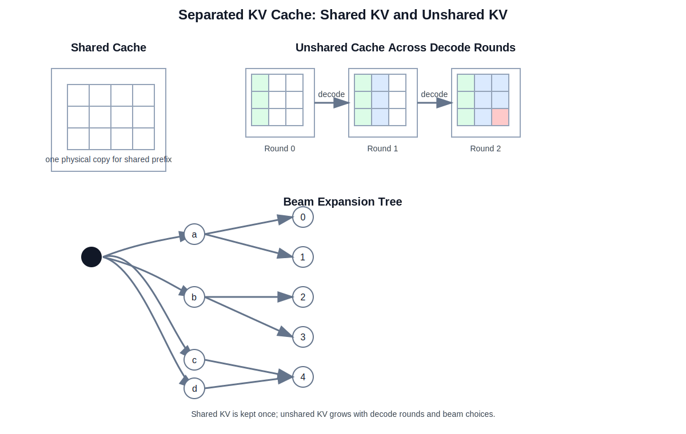
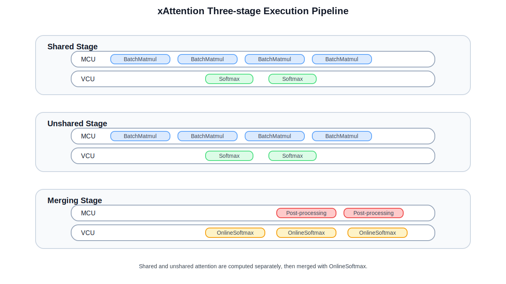

# Generative Recommendation Design Document

## Overview

xLLM provides generative recommendation inference through the `backend=rec` path. The goal is not to replace the existing recommendation system, but to reuse the LLM inference engine in the recommendation pipeline while keeping the original predictor-side sparse feature processing and online serving capabilities. In practice, the LLM body is executed by xLLM, while the traditional recommendation system continues to handle feature preparation and online integration.

This document focuses on the following topics:

- the goal and constraints of generative recommendation inference
- model structure and integration architecture
- why the REC path prefers fixed scheduling and whole-graph multi-step execution
- how `xAttention` and `beam search` cooperate around memory efficiency and execution efficiency
- where the core REC-related code is located in the current branch

The design goals of this document are:

- explain the `backend=rec` path with a unified view
- clarify the relation among fixed scheduling, multi-step execution, and custom kernels
- provide a stable base document for future technical sharing and code walkthroughs

The non-goals of this document are:

- full training details of recommendation models
- all online serving differences across business scenarios
- replacing detailed module-level API documents

## 1. Background and Problem

In recent years, LLM-based generative recommendation has made substantial progress. xLLM has also introduced support for recommendation inference. The goal of generative recommendation is not simply to attach an LLM to a recommendation system, but to use generative modeling to improve candidate expansion and ranking quality, especially metrics such as `CTR`.

In the current solution, xLLM serves as the unified inference engine and is integrated into the existing prediction pipeline through a shared library (`.so`) interface:

- the `predictor` side continues to handle sparse feature processing, sample construction, and online service integration;
- the `xLLM` side is responsible for the LLM-related inference computation.

This split allows the original recommendation engineering capabilities to remain intact, while reusing xLLM's infrastructure in operators, KV cache management, multi-backend execution, and scheduling.

However, generative recommendation and general LLM inference optimize for different targets.

- General LLM inference cares more about token-by-token interaction quality, such as returning the first result quickly, reducing the interval between generated tokens, and allowing requests to be inserted or ended dynamically.
- Generative recommendation cares more about total request latency and obtaining better candidate results within a limited number of decoding rounds.

The reason is straightforward: recommendation is usually not about generating an open-ended passage, but about expanding candidates, comparing candidates, and outputting the best result within a fixed number of rounds.


This path often uses `beam search`. In this context, beam search means that at each decoding round the system keeps multiple high-scoring candidate branches instead of only the best one, then keeps expanding and comparing them in later rounds. In recommendation, the purpose is not to generate longer text, but to cover more high-quality candidates within a small number of decoding rounds and improve the final recommendation quality.


Therefore, generative recommendation naturally has two characteristics:

- fixed-step decoding;
- synchronized comparison of multiple candidates.

In other words, the real optimization target is not “make one sequence finish earlier”, but “push multiple candidates forward stably in a small number of rounds and compare them efficiently at each round”. This leads directly to the later design choice: fixed scheduling at the control layer and whole-graph multi-step execution at the execution layer, followed by custom operator optimization on top of that stable execution shape.

## 2. Inference Architecture

### 2.1 Model Structure

Generative recommendation has become one of the most important paradigm shifts in modern recommendation systems. It breaks the traditional recall-ranking-rerank cascade and pushes the task from discriminative matching toward generative prediction. This document focuses on two model families that have shown strong quality and have been deployed at scale: OneRec for recall and OneTrans for ranking.


A shared pattern across these models is that they keep the traditional recommendation signals such as user sequence features, user static features, and context features, then use an input adaptation layer to map heterogeneous recommendation inputs (discrete IDs, continuous values, sequences, and multimodal content) into embeddings that can be consumed by the LLM decoder. The model body itself is still an Encoder+Decoder or Decoder-only LLM structure, which means different parts of the model should be handled by different inference engines.

### 2.2 Inference Integration Architecture

Based on the model structure, the current solution splits the model into two groups:

- the input adaptation layer still belongs to the traditional CTR-style inference domain and is handled by the `predictor` side;
- the LLM body is handled by xLLM.

As the core LLM inference engine, xLLM provides two integration modes for generative recommendation: RPC integration and shared library (`.so`) integration.

#### 2.2.1 RPC Integration

The current marketing and online recall scenarios mainly use the RPC-based integration mode. Its advantage is a clean service boundary, while the downside is the extra RPC overhead.

#### 2.2.2 Shared Library Integration

Another mode is to embed xLLM into the predictor side as an internal inference engine for the LLM subgraph. This avoids RPC round trips and is more suitable for future low-latency scenarios.



## 3. Fixed Scheduling and Graph-style Execution

### 3.1 Fixed-Step Scheduling


The figure above comes from the paper *Orca: A Distributed Serving System for Transformer-Based Generative Models*. It explains why continuous batching is useful for general text generation: it avoids idle compute caused by rigid fixed-batch execution.

Generative recommendation changes that assumption because the decoding length is fixed and the candidate set needs to move forward synchronously. As a result, the REC path is more suitable for `fixed_steps_scheduler` than for continuous batching. The reason is not simply “fixed rounds imply fixed scheduling”. The deeper reason is that the workload itself is organized as a fixed number of rounds. When requests usually finish in a predefined number of rounds and multiple candidate branches must move forward together, the scheduler should focus on sending one stable candidate group efficiently instead of inserting and removing requests at every step.

The first benefit of `fixed_steps_scheduler` is that it matches `beam search` better. In the decode stage, `beam width` is often large and multiple beams need to move and be compared in the same round. If continuous scheduling is used, every step may trigger batch rebuilding, sequence compaction, index remapping, and state pruning. Those operations make sense for general LLM inference because requests really do end dynamically. In generative recommendation, however, they are often additional cost instead of real value. Under fixed scheduling, the beam group of one request can move forward together inside one fixed window, without repeated batch rebuilding and repeated pruning decisions.

The second benefit is execution stability. Once the number of rounds, the beam-group size, and the advancing rhythm all become stable, many later optimizations become possible. Buffers can be allocated early, workspace can be reused more easily, and cache access patterns become more regular. This stability makes profiling and capacity planning easier and allows the execution path to be made much more stable.


The third benefit is that it reduces overhead outside the real model computation. In recommendation inference, the major cost should belong to candidate expansion, attention computation, and beam comparison. But if the scheduler keeps participating in sequence reordering, batch rebuilding, metadata refresh, and index movement at every step, then extra overhead is introduced even though it is not part of the actual operator work. In this sense, fixed scheduling trades stronger execution determinism for higher throughput, lower scheduling overhead, and more stable runtime behavior.

Of course, fixed scheduling also has a clear cost: a new request may wait longer. Under continuous scheduling, a new request may have a chance to be inserted after only one step. Under fixed scheduling, it often has to wait until the current fixed window finishes. This leads to a more visible queueing delay. The mitigation direction is not to go back to continuous scheduling, but to introduce `multi-stream` execution. The idea is to decouple the large request groups already running inside a fixed window from newly arriving small request groups and place them on different streams or execution channels. The purpose is not to eliminate waiting entirely, but to keep the throughput advantage of fixed scheduling while reducing the extra access latency of new requests.

### 3.2 Graph-style Multi-Step Execution

On top of fixed scheduling, `multi_step_pipeline` becomes the natural execution-side companion. It solves an execution-efficiency problem. Once we know the workload itself always runs a fixed number of rounds and does not usually end early, then there is no need to involve the host at every step. There is no need to perform a `D2H` synchronization every round just to ask whether the batch is finished, and there is no need to perform another `H2D` transfer every round just to prepare the next round's input. A more efficient design is to prepare the space, indices, and data structures needed by later rounds at the first step, and then let the device continue advancing through the later rounds.

This brings several direct benefits:

- fewer `D2H/H2D` round trips and less host participation;
- lower launch and control overhead at every round;
- better device-side data reuse because more intermediate data stays on device;
- a more pipeline-like execution flow instead of a repeated stop-prepare-run cycle.

For a fixed-round recommendation workload, this is clearly more efficient than returning to the host after every step.

Another important but often underestimated benefit of `multi_step_pipeline` is that it creates a better execution environment for custom operators. This is the point where `xAttention` and `beam search` custom kernels can be discussed together. `fixed step` solves scheduling stability, while whole-graph multi-step execution plus custom kernels solves execution efficiency.

## 4. Memory Management and Operator Co-optimization

### 4.1 Compute and Memory Bottlenecks

#### 4.1.1 Model Input and Output Characteristics

In the current generative recommendation setup, an item ID is represented by a fixed-length token sequence. As a result, `decode_step` is a known small constant, for example 3. One request can be summarized as:

- one prefill stage with a long user-history context;
- `decode_step` rounds of decode, where each round generates one token and the final token sequence is combined into an item ID.

Even if the number of decode rounds is small, the per-step cost is not small. To improve recall and diversity, generative recommendation often uses a large `beam_width`. In addition, each beam may expand to `top_k` candidates, and the system then selects the new beam set from a global candidate pool of `beam_width × top_k`. For example, when `beam_width=512` and `top_k=512`, the candidate pool size of one decode round reaches 262144 (about 2.6×10^5). So although the number of rounds is limited, the search and KV access cost per step is still considerable.

#### 4.1.2 Storage Redundancy and Memory Fragmentation

The main bottlenecks of this inference service can be summarized into two groups, and `xAttention` is designed around both of them.

The first is redundant bandwidth consumption in attention. Shared prefixes are not explicitly represented as reusable structures. When beam width is large, all beams share the same long prompt, but a generic implementation often organizes KV as if every beam were a full independent sequence. This causes shared KV to be loaded repeatedly along the beam dimension and reduces the effective arithmetic intensity of the attention kernel, eventually making the path bandwidth-bound.

The second is KV cache copying and fragmentation. Beam search frequently forks and retires branches, which leads to beam reordering. For a block-based KV management scheme such as PagedAttention, “reordering + block alignment” often implies block copying, fragmentation, and extra memory waste. Both memory capacity and memory bandwidth get amplified in the wrong direction.

### 4.2 `xAttention` Design Principle

#### 4.2.1 KV Cache Layout Optimization



Given the fixed structure of generative recommendation inference, xAttention redesigns both KV cache organization and the attention execution strategy. The shared prefix is stored only once at the physical-memory level, while beam branching and reordering no longer cause high-cost copying.

The first key idea is to split KV cache into two groups:

- **Shared KV**: prompt KV generated in prefill and shared by all beams;
- **Unshared KV**: newly generated KV in decode, managed at token granularity for each beam.

Once the cache is split this way, Unshared KV only stores the decode-generated tokens, which avoids both block copying and unnecessary memory waste.

#### 4.2.2 Attention Compute Optimization



To avoid concatenating Shared KV and Unshared KV into one long logical sequence, xAttention splits one attention computation into three stages:

1. **shared stage**: compute local softmax statistics and partial outputs only on Shared KV;
2. **unshared stage**: compute local statistics and partial outputs only on Unshared KV;
3. **merge stage**: use OnlineSoftmax to merge the two parts stably.

At the parallelization level, shared, unshared, and merge are assigned to different execution units or queues to form a pipeline. The goal is to overlap Shared and Unshared computation as much as possible while minimizing synchronization points.

## 5. Code Layout

The current branch organizes the generative recommendation path as follows.

External integration:
- `xllm/c_api/rec.h`
- `xllm/c_api/internal/rec.cpp`
- `xllm/c_api/examples/simple_rec_completions.cpp`

Service entry:
- `xllm/api_service/rec_completion_service_impl.cpp`
- `xllm/api_service/chat_service_impl.cpp`
- `xllm/api_service/api_service.cpp`
- `xllm/api_service/api_service.h`

Scheduling and engine:
- `xllm/core/distributed_runtime/rec_master.cpp`
- `xllm/core/distributed_runtime/rec_master.h`
- `xllm/core/scheduler/fixed_steps_scheduler.cpp`
- `xllm/core/scheduler/fixed_steps_scheduler.h`
- `xllm/core/distributed_runtime/rec_engine.cpp`
- `xllm/core/distributed_runtime/rec_engine.h`

Batch / request / proto:
- `xllm/core/framework/batch/rec_batch_input_builder.cpp`
- `xllm/core/framework/batch/rec_batch_input_builder.h`
- `xllm/core/framework/batch/rec_multi_round_batch_input_builder.cpp`
- `xllm/core/framework/batch/rec_multi_round_batch_input_builder.h`
- `xllm/core/framework/request/rec_type.h`
- `xllm/proto/rec.proto`
- `xllm/proto/completion.proto`
- `xllm/proto/xllm_service.proto`

Runtime / worker:
- `xllm/core/runtime/rec_worker_impl.cpp`
- `xllm/core/runtime/rec_worker_impl.h`

Kernel hot path:
- `xllm/core/layers/cuda/xattention.cpp`
- `xllm/core/layers/cuda/flashinfer_attention.cpp`
- `xllm/core/kernels/cuda/xattention/beam_search.cpp`
- `xllm/core/kernels/cuda/xattention/cache_select.cu`

## 6. Current-branch Execution Flow

To align the design with the actual implementation, the current branch can be understood as the following execution chain:

1. **External entry**
   - In shared-library mode, requests enter from `xllm/c_api/internal/rec.cpp` through `xllm_rec_text_completions`, `xllm_rec_token_completions`, or `xllm_rec_chat_completions`.
   - In service mode, requests enter from `xllm/api_service/rec_completion_service_impl.cpp` or `chat_service_impl.cpp`, and are then forwarded to `RecMaster`.

2. **Request convergence in `RecMaster`**
   - `RecMaster` unifies different request forms such as prompt input, token input, and raw embedding input.
   - It also distinguishes `kOneRec` and `kLlmRec`, then selects the corresponding request pipeline.

3. **Entering fixed scheduling**
   - `RecMaster` creates `FixedStepsScheduler` directly during initialization.
   - Instead of rebuilding decode batches dynamically at every step, the scheduler is centered on a fixed number of rounds and a stable candidate group.

4. **Engine execution**
   - `RecEngine` then selects an execution path according to `RecPipelineType`.
   - For the `LlmRec` multi-round scenario, execution is routed into `RecMultiRoundEnginePipeline`, which pushes more decode control logic down toward the worker side.

5. **Batch building and input construction**
   - `RecBatchInputBuilder` and `RecMultiRoundBatchInputBuilder` organize sequences, step information, decode positions, sampling parameters, and other metadata into `ForwardInput`.
   - `step_meta` is especially important here because it provides the per-round information needed for multi-step execution.

6. **Multi-round execution inside the worker**
   - `RecWorkerImpl::LlmRecMultiRoundPipeline::step()` performs a device-side round loop.
   - For each round, it coordinates:
     - current-round input preparation
     - model forward
     - sample processing
     - beam search
     - cache selection
     - preparation for the next round

7. **Hot operator path**
   - Attention-related execution goes through `xattention.cpp` and `flashinfer_attention.cpp`
   - Beam-related selection goes through `beam_search.cpp`
   - Cache selection after beam reordering goes through `cache_select.cu`

From a technical-sharing perspective, this chain is a useful narrative backbone because it connects fixed scheduling, whole-graph multi-step execution, and custom kernels into one coherent execution story instead of presenting them as isolated optimizations.

## 7. Trade-offs and Applicability Boundaries

This design does not mean that fixed scheduling is always better than continuous scheduling, nor does it mean that multi-step pipeline execution fits every generation task. It works well because the current generative recommendation workload has a few specific characteristics:

- the number of decode rounds is relatively fixed and requests usually do not terminate early like open-ended text generation;
- one request often carries a large `beam_width`, and multiple beams must be compared synchronously;
- total request latency matters more than token-by-token interactivity;
- device-side state such as KV cache, positions, and beam tensors can be prepared and reused in a relatively stable way.

When those conditions hold, fixed scheduling and multi-step execution provide clear benefits. At the same time, they also have clear boundaries:

### 7.1 Boundary of fixed scheduling

- If request lengths vary dramatically and a large number of requests end early, continuous scheduling regains its advantage.
- If the business priority is to insert new requests as soon as possible, fixed scheduling naturally becomes less attractive.
- If candidate expansion no longer depends on synchronized beam progression, the benefit of a fixed execution window decreases.

### 7.2 Boundary of `multi_step_pipeline`

- If each step still requires strong host-side decisions, the value of device-side multi-step execution becomes smaller.
- If shape, batch layout, or key inputs change significantly at every round, it becomes much harder to keep a stable whole-graph execution path.
- If backend operators themselves are not ready for stable multi-round device-side execution, whole-graph execution will remain only a conceptual idea.

### 7.3 Boundary of custom operators

`xAttention` and custom `beam search` kernels are valuable because the execution shape is already stable enough. Without fixed-step scheduling and multi-step device-side progression, many operator-level optimizations would be diluted by repeated data movement, batch rebuilding, and extra host participation.

So the more accurate order of reasoning is:

1. first confirm that the workload truly fits fixed scheduling;
2. then confirm that multi-round execution can be pushed down to the device side;
3. only then optimize the stable hot path with custom operators.

This is what makes `fixed_steps_scheduler`, `multi_step_pipeline`, `xAttention`, and `beam search` a coherent design stack rather than four unrelated optimization tricks.

## 8. Code Path Appendix

The purpose of this appendix is not to repeat the file list in the previous section, but to provide a practical reading order. If someone later wants to expand this document, prepare a technical talk, or walk through the implementation, the following path is a more useful starting point.

### 8.1 Start from the external entry

If the goal is to understand how `predictor` or the shared-library integration enters xLLM, start with:

- `xllm/c_api/rec.h`
  - exposes `xllm_rec_create`, `xllm_rec_initialize`, `xllm_rec_text_completions`, `xllm_rec_token_completions`, and `xllm_rec_chat_completions`
  - useful for understanding what the REC-facing external contract looks like
- `xllm/c_api/internal/rec.cpp`
  - the actual CAPI implementation
  - useful for seeing how request parameters are wrapped and forwarded in `.so` mode
- `xllm/c_api/examples/simple_rec_completions.cpp`
  - the smallest runnable example
  - useful when explaining what a dynamic-library integration looks like in practice

If the technical-sharing version needs one “minimal usage example”, this is the best layer to cite first.

### 8.2 Then read the service entry layer

If the focus is on RPC mode or the unified service path, continue with:

- `xllm/api_service/api_service.cpp`
  - dispatches service implementations according to `FLAGS_backend`
  - under `backend == "rec"`, both `rec_completion_service_impl_` and `chat_service_impl_` are attached
- `xllm/api_service/rec_completion_service_impl.cpp`
  - forwards REC completion requests into `RecMaster`
  - this is where `routing`, `input_tensors`, and `RequestParams` are assembled together
- `xllm/api_service/chat_service_impl.cpp`
  - also provides a chat entry for `RecMaster`
  - useful to show that REC is not limited to token completion only

This layer is useful in a technical talk when explaining that `backend=rec` is not a side path outside the service framework, but a first-class backend integrated into the existing service entry.

### 8.3 Then read scheduling and engine as one chain

If the main story is “why fixed step is a better fit for REC”, a practical reading order is:

1. `xllm/core/distributed_runtime/rec_master.h`
2. `xllm/core/distributed_runtime/rec_master.cpp`
3. `xllm/core/scheduler/fixed_steps_scheduler.h`
4. `xllm/core/scheduler/fixed_steps_scheduler.cpp`
5. `xllm/core/distributed_runtime/rec_engine.h`
6. `xllm/core/distributed_runtime/rec_engine.cpp`

The chain can be understood as:

```text
Rec request
  -> RecMaster
  -> FixedStepsScheduler
  -> RecEngine
  -> RecEnginePipeline
  -> Worker / worker_clients
```

The most important takeaways in this layer are:

- `RecMaster` converges multiple request forms and chooses the request pipeline
- `FixedStepsScheduler` organizes requests into a batch shape that matches fixed-round progression
- `RecEngine` bridges the scheduler output to the actual execution path
- `RecMultiRoundEnginePipeline` is the concrete code path that represents “push multi-round decode control further down”

If the talk needs to prove that “fixed step is not just an idea but the actual code path”, this is the core evidence layer.

### 8.4 Read batch builders to understand why multi-step execution is possible

To explain why `multi_step_pipeline` is possible, it is not enough to stop at the scheduler. The batch builder layer is equally important:

- `xllm/core/framework/batch/rec_batch_input_builder.h`
- `xllm/core/framework/batch/rec_batch_input_builder.cpp`
- `xllm/core/framework/batch/rec_multi_round_batch_input_builder.h`
- `xllm/core/framework/batch/rec_multi_round_batch_input_builder.cpp`
- `xllm/core/framework/batch/batch.cpp`

The key points here are:

- `RecBatchInputBuilder::create(...)` chooses different builders according to `RecType` and multi-round mode
- `RecMultiRoundBatchInputBuilder` is not just a small variation of the default builder, but a dedicated implementation for multi-round decode input construction
- `step_meta`, `decode_positions`, `sampling params`, and `batch forward type` are assembled here before being sent further into runtime

So if the document or talk wants to explain “why later rounds can already be prepared at the first step”, this layer is more important than only talking about the engine loop.

### 8.5 Read worker-side multi-round execution next

The most valuable implementation details of `multi_step_pipeline` are inside:

- `xllm/core/runtime/rec_worker_impl.h`
- `xllm/core/runtime/rec_worker_impl.cpp`

Especially these parts:

- `RecWorkerImpl::step_async(...)`
  - shows how work is dispatched into the worker and onto the target stream
- `RecWorkerImpl::LlmRecMultiRoundPipeline::prepare_inputs(...)`
  - shows how multi-round inputs enter runtime
- `RecWorkerImpl::LlmRecMultiRoundPipeline::allocate_kv_caches_related()`
  - shows why fixed-step execution is friendly to early KV-related allocation
- `RecWorkerImpl::LlmRecMultiRoundPipeline::step(...)`
  - this is the single most important function for multi-round execution
  - it makes the relationship among round loop, beam search, cache select, and next-round preparation explicit
- `compute_next_round_input_async(...)`
  - this is the key function when explaining why host round-trips can be reduced

If a technical talk wants to emphasize execution efficiency rather than scheduling policy, this is the best layer to expand.

### 8.6 Finally read the hot operator path

If the goal is to explain why `xAttention` and custom `beam search` kernels matter, the recommended reading order is:

- `xllm/core/layers/cuda/xattention.cpp`
- `xllm/core/layers/cuda/flashinfer_attention.cpp`
- `xllm/core/kernels/cuda/xattention/xattention_ops_api.h`
- `xllm/core/kernels/cuda/xattention/beam_search.cpp`
- `xllm/core/kernels/cuda/xattention/cache_select.cu`

This layer helps answer three questions:

1. where the stable attention execution path actually lives
2. why beam search is not only a scheduling topic but also a hot kernel path
3. why cache selection after beam reordering must be discussed together with execution shape

In other words, if the technical-sharing narrative wants to connect `fixed_steps_scheduler`, `multi_step_pipeline`, `xAttention`, and `beam search` into one coherent story, it eventually has to land here.

### 8.7 Recommended reading order

If this document is expanded further later, the recommended code-reading order is:

```text
entry
  -> api_service
  -> RecMaster
  -> FixedStepsScheduler
  -> RecEngine
  -> RecBatchInputBuilder / RecMultiRoundBatchInputBuilder
  -> RecWorkerImpl::LlmRecMultiRoundPipeline
  -> xAttention / beam_search / cache_select
```

The advantage of this order is that it matches how people usually understand the system:

- first, how the request enters the system
- then, why REC prefers fixed-step scheduling
- then, how multi-step execution is actually pushed down to the device side
- finally, why custom operators become valuable only after the execution shape becomes stable

This makes the logic easier to present in a technical talk and easier to reuse in future documentation work.

## 9. Verification

Before merging, at least the following checks are recommended:

- confirm that both the Chinese and English design documents render correctly;
- confirm that every image reference resolves to an actual file under `docs/assets/`;
- confirm that the English document points to English diagrams instead of Chinese-labeled figures;
- confirm that the documentation entry pages can navigate to this design document.
