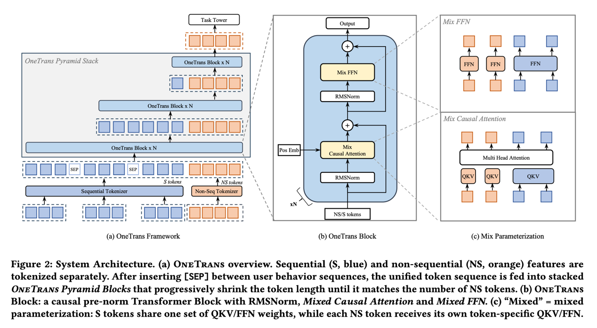

# 生成式推荐设计文档

## 概述

xLLM 在 `backend=rec` 场景下提供了生成式推荐推理能力。其目标不是替代现有推荐系统，而是在保留 `predictor` 侧稀疏特征处理和在线服务能力的前提下，把 LLM 主体推理能力复用到推荐场景中，用于候选扩展、候选比较和最终结果生成。

本文档重点说明以下内容：

- 生成式推荐场景的目标与约束
- 推荐模型结构与推理接入方式
- 为什么推荐场景更适合固定调度和整图执行
- `xAttention` 与 `beam search` 如何围绕显存和执行效率协同优化
- 当前分支中与生成式推荐相关的核心代码分布

本文档的设计目标包括：

- 用统一视角解释 `backend=rec` 的推理链路
- 说明固定调度、整图执行和定制算子之间的关系
- 为后续技术分享、代码走读和文档扩展提供稳定底稿

本文档的非目标包括：

- 不展开推荐模型训练细节
- 不覆盖所有线上业务接入差异
- 不替代各模块的详细 API 文档

## 1. 背景和问题

最近几年，基于 LLM 的生成式推荐取得了比较明显的进展。在 xLLM 中，我们也逐步补齐了对生成式推荐推理的支持。生成式推荐的目标，不是简单把大模型能力接进推荐系统，而是希望利用生成式建模能力，在候选扩展和排序阶段提升效果，尤其是提升 `CTR` 这类核心指标。

在当前方案中，我们使用自研 xLLM 作为统一推理引擎，通过 `so` 方式接入现有预测链路：

- `predictor` 侧继续负责稀疏特征处理、样本组织和在线服务集成；
- `xLLM` 侧负责完成 LLM 相关推理计算。

这样做的价值在于，推荐系统原有的工程能力可以保留，而 xLLM 在算子、KV Cache、多后端执行和调度上的基础设施也能够直接复用。

但生成式推荐和通用 LLM 推理，优化目标并不相同。

- 通用 LLM 推理更关注逐步生成的体验，例如尽快返回第一个结果、尽量缩短每一步生成之间的间隔，并允许请求在执行过程中灵活插入和提前结束；
- 生成式推荐更关注整次请求的总时延，以及在有限几轮内得到更优的候选结果。

原因很直接：推荐场景通常不是生成一段开放文本，而是在固定几轮里不断扩展候选、比较候选，最后输出更优结果。

这里经常会用到 `beam search`。可以把它理解为：在每一轮里，不只保留当前最优的一条路径，而是同时保留多个高分候选，并在后续轮次继续扩展和比较，最后从这些候选里选出更优结果。在推荐场景里，这样做的意义不是“生成更长内容”，而是“在有限几步内覆盖更多高质量候选，提高最终推荐效果”。

因此，生成式推荐天然有两个特征：

- 固定步数推进；
- 多个候选同步比较。

也就是说，这个场景真正要优化的，不是“某一条序列先跑完”，而是“多个候选在固定几轮里稳定推进，并在每一轮完成低开销比较”。这也决定了后续的设计方向：调度层更适合使用固定调度，执行层更适合做整图执行，并在稳定执行形态上做专门的算子优化。

## 2. 推理架构

### 2.1 模型结构介绍

生成式推荐是近两年推荐系统领域的重要方向。它正在打破传统“召回-排序-重排”的级联边界，把推荐任务从“判别式匹配”推进到“生成式预测”。当前文档里重点关注两类已经在线上大规模使用的模型：用于召回的 OneRec 模型，以及用于精排的 OneTrans 模型。

从这些模型的共同点来看，它们保留了传统 CTR 场景里的序列特征、用户静态特征和上下文特征，并由输入适配层把异构推荐信号（离散 ID、连续值、序列、多模态内容）统一映射为 LLM Decoder 可理解的嵌入表示（embedding），必要时再与 LLM 的词表嵌入空间对齐。模型主体则是 LLM 的 Encoder+Decoder 或 Decoder-only 结构，因此不同部分需要不同的推理引擎承接。

### 2.2 推理架构介绍

根据模型结构特点，当前方案把模型切成两类子图：

- 输入适配层仍然归属于传统 CTR 推理范畴，由 `predictor` 承接；
- LLM 主体部分由 xLLM 承接。

作为 LLM 推理的核心引擎，xLLM 在生成式推荐场景下提供了两种接入方式：RPC 接入与动态库接入。

#### 2.2.1 RPC 接入方式

当前营销、黄流等场景的生成式召回主要采用 RPC 方式接入。它的优点是服务边界清晰、接入方式稳定，但也会引入额外的 RPC 调用开销。

#### 2.2.2 动态库接入方式

另一种方式是把 xLLM 作为 `predictor` 内部的独立推理引擎，对模型中属于 LLM 主体的子图直接做推理。这样可以省掉 RPC 往返开销，后续更适合承接需要低延迟的相关业务。

## 3. 固定调度与整图执行

### 3.1 固定步数调度

上图来自论文《Orca: A Distributed Serving System for Transformer-Based Generative Models》，它介绍了 `continuous batching` 的背景：通过动态重组 batch，避免固定 batch 调度导致算力空转。

但生成式推荐是固定步数的，这一点改变了调度问题本身。从调度角度看，生成式推荐更适合 `fixed_steps_scheduler`，而不是 `continuous batching`。原因不只是“固定步数所以固定调度”，而是因为这个场景本身就是按固定几轮来组织计算的。既然请求通常会在约定好的几步里完成，而且多个候选需要同步向前推进，那么调度器最重要的任务就不是“随时插队、随时清退”，而是“把这一组候选稳定地发出去，并尽量减少额外调度动作”。

`fixed_steps_scheduler` 的第一个好处，是更适合 `beam search`。在 `decode` 阶段，`beam size` 往往比较大，我们希望多个 beam 在同一轮里一起推进、一起比较。如果采用连续调度，那么每一步都可能触发 batch 重组、sequence 压缩、索引重排和状态裁剪。这些动作在通用 LLM 推理里是合理的，因为请求确实会动态结束；但在生成式推荐里，它们很多时候并不是收益，而是额外成本。使用固定调度之后，同一个请求下的多个 beam 可以在固定窗口里齐头并进，调度器不需要每一步都重新组织 batch，也不需要反复判断哪些序列该保留、哪些序列该剔除。这样做可以明显减少调度层的控制开销。

第二个好处，是执行形态会更稳定。一旦解码轮数固定、beam group 规模固定、推进节奏固定，很多后续优化才真正有了基础。比如 buffer 可以提前分配，workspace 更容易复用，cache 访问模式也更规整。对于性能优化来说，这种稳定性很重要，因为它意味着更容易做 profiling、更容易做容量规划，也更容易把执行链路固化下来。换句话说，`fixed_steps_scheduler` 解决的是调度稳定性问题，它让执行入口从动态、不规则、频繁变化的状态，收敛成了一个稳定的固定窗口。

第三个好处，是它减少了很多与模型计算无关的损耗。在推荐场景里，主要成本本来应该集中在真正的候选扩展、注意力计算和 beam 比较上；但如果每一步都让调度器参与 sequence 重排、batch 重组、元数据更新和索引搬运，那么会引入不少“不是算子本身、但又必须付出”的额外成本。从这个角度看，固定调度本质上是在用更强的执行确定性，换更高的吞吐、更低的调度成本以及更稳定的运行时行为。

当然，固定调度也有代价。最明显的问题就是，新请求的等待时间会变长。因为连续调度的一个优势，是新请求可能等一步就有机会被插入；而固定调度下，新请求通常要等当前这一轮固定窗口结束，才能进入下一轮执行。这会带来更明显的排队等待。这个问题的缓解方向，不是退回到连续调度，而是引入 `multi-stream`。也就是说，把已经在固定窗口里的大批请求和新接入的小批请求尽量解耦，让它们落在不同 stream 或不同执行通道上。这样做的目的，不是完全消除等待，而是在保住固定调度吞吐优势的同时，降低新请求接入的额外时延。

### 3.2 整图执行

在这个基础上，`multi_step_pipeline` 就成为固定调度的天然配套设计。它解决的是执行效率问题。既然我们已经知道这个场景本身就是固定几步，而且通常不会提前结束，那么就没有必要每一步都让 host 参与一次控制：没有必要每一步都做一次 `D2H` 去判断“这一批是不是结束了”，也没有必要每一步都再做一次 `H2D` 去准备下一轮输入。更高效的做法，是在第一步启动时，就把后续若干步需要用到的空间、索引和数据结构一次性准备好，然后让 device 侧连续向前推进。

这样做的收益非常直接：

- 减少 `D2H/H2D` 往返，降低 host 参与频率；
- 减少每一步的 launch 和控制开销；
- 让更多中间数据停留在 device 侧，提高数据复用效率；
- 让整段执行过程更像一条连续流水，而不是“每一步停一下、准备一下、再继续”。

对于生成式推荐这种固定轮数任务来说，这种连续执行方式明显比逐步回到 host 再下发下一轮更高效。

`multi_step_pipeline` 还有一个经常被低估的价值，就是它为定制算子创造了更好的运行条件。在执行形态稳定之后，配合定制算子把关键热路径进一步做快。`fixed step` 解决的是调度稳定性，而整图执行加上算子定制，解决的是执行效率。

## 4. 显存管理与算子协同优化

### 4.1 计算与显存瓶颈

#### 4.1.1 模型输入输出特征

在当前生成式推荐推理设定中，item id 由固定长度 token 序列表示，因此 `decode_step` 是已知的小常数（例如 3）。一次请求的推理流程可以概括为：

- 一次 prefill：输入为长序列，即用户历史上下文；
- `decode_step` 次 decode：每步生成 1 个 token，最终组合为 item id。

单步 decode 的单位开销并不低。为了召回与多样性，生成式推荐通常需要较大的 `beam_width`；同时每条 beam 还要扩展 `top_k` 个候选，再在全局候选池 `beam_width × top_k` 上选择新的 beam 集合，最终 beam 集合大小仍保持为 `beam_width`。例如当 `beam_width=512`、`top_k=512` 时，单步候选池大小达到 262144（约 2.6×10^5）。因此 decode 的步数虽然不多，但每步的搜索选择与 KV 访问开销仍然不低。

#### 4.1.2 存储冗余与显存碎片

生成式推荐推理服务的主要瓶颈可以拆成两类，而 `xAttention` 就是围绕这两类问题来设计的。

第一类是 Attention 的冗余带宽消耗：shared prefix 没有被显式建模为可复用结构。在较大的 beam 场景下，所有 beam 都共享同一段长 prompt，但通用实现往往以“每条 beam 一条完整序列”的视角组织 KV，导致 Shared KV 在 beam 维度被重复触发加载，attention kernel 的有效算术强度下降，最终受限于 HBM 带宽。

第二类是 KV Cache 的复制与碎片：beam 分叉与 block 级管理之间存在结构性冲突。beam search 会频繁 fork 与 retire，并触发 beam 重排。对于基于 block 的 KV 管理（例如 PagedAttention 一类），“重排 + block 对齐”往往意味着 block copy、碎片化以及额外空间浪费，显存和带宽都会被放大。

### 4.2 `xAttention` 设计原理

#### 4.2.1 KV Cache 存储优化

围绕当前生成式推荐推理的固定结构，xAttention 把 KV Cache 的组织方式与 attention 计算和并行策略一起重新设计，将 shared prefix 在显存层面只存一份，同时 beam 的分叉与重排不再触发高代价的数据拷贝。

首先，KV Cache 被按“是否共享前缀”拆成两类：

- **Shared KV**：prefill 阶段生成的 prompt KV，所有 beam 共享同一份物理存储；
- **Unshared KV**：decode 阶段每条 beam 新生成 token 的 KV，按 token 粒度管理。

拆成两类 KV 之后，Unshared KV 只存储 decode 阶段产生的新 token，从而避免 block copy 与显存浪费。

#### 4.2.2 Attention 计算优化

为了避免把 Shared 与 Unshared KV 直接拼接成一个逻辑长序列，以及由此带来的访存与拷贝问题，xAttention 把一次 attention 拆成三个阶段：

1. **shared stage**：仅对 Shared KV 计算局部 softmax 统计量与部分输出；
2. **unshared stage**：仅对 Unshared KV 计算局部统计量与部分输出；
3. **merge stage**：使用 OnlineSoftmax 把两段结果稳定合并。

并行化层面，会把 shared、unshared 与 merge 分配到不同执行单元和队列中形成流水线，目标是让 Shared 与 Unshared 的计算尽量重叠执行，同时把同步点压缩到最少。

## 5. 代码结构

当前分支里，生成式推荐相关代码可以按下面的结构理解：

外部接入：
- `xllm/c_api/rec.h`
- `xllm/c_api/internal/rec.cpp`
- `xllm/c_api/examples/simple_rec_completions.cpp`

服务入口：
- `xllm/api_service/rec_completion_service_impl.cpp`
- `xllm/api_service/chat_service_impl.cpp`
- `xllm/api_service/api_service.cpp`
- `xllm/api_service/api_service.h`

调度与引擎：
- `xllm/core/distributed_runtime/rec_master.cpp`
- `xllm/core/distributed_runtime/rec_master.h`
- `xllm/core/scheduler/fixed_steps_scheduler.cpp`
- `xllm/core/scheduler/fixed_steps_scheduler.h`
- `xllm/core/distributed_runtime/rec_engine.cpp`
- `xllm/core/distributed_runtime/rec_engine.h`

batch / request / proto：
- `xllm/core/framework/batch/rec_batch_input_builder.cpp`
- `xllm/core/framework/batch/rec_batch_input_builder.h`
- `xllm/core/framework/batch/rec_multi_round_batch_input_builder.cpp`
- `xllm/core/framework/batch/rec_multi_round_batch_input_builder.h`
- `xllm/core/framework/request/rec_type.h`
- `xllm/proto/rec.proto`
- `xllm/proto/completion.proto`
- `xllm/proto/xllm_service.proto`

runtime / worker：
- `xllm/core/runtime/rec_worker_impl.cpp`
- `xllm/core/runtime/rec_worker_impl.h`

kernel / 算子热路径：
- `xllm/core/layers/cuda/xattention.cpp`
- `xllm/core/layers/cuda/flashinfer_attention.cpp`
- `xllm/core/kernels/cuda/xattention/beam_search.cpp`
- `xllm/core/kernels/cuda/xattention/cache_select.cu`
