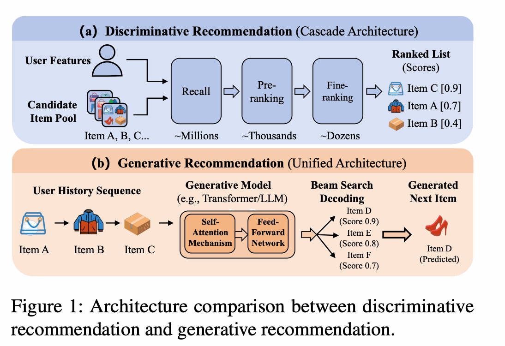
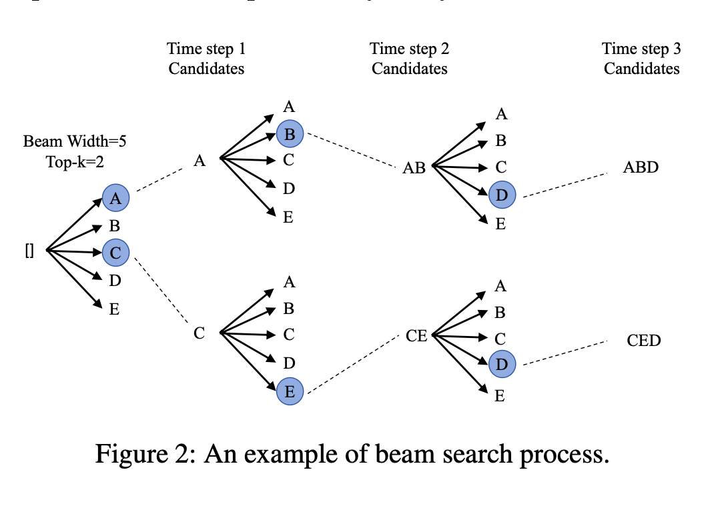
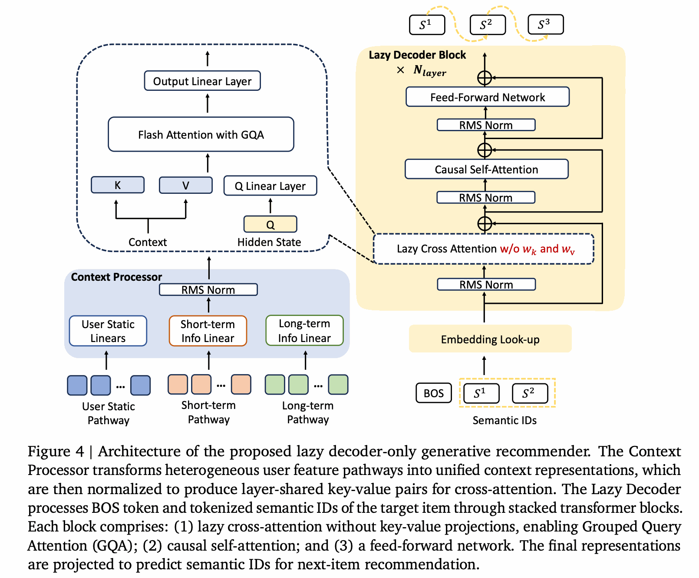
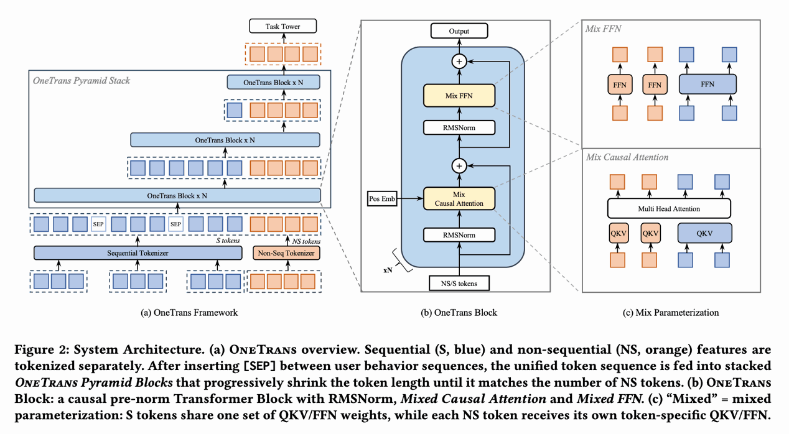
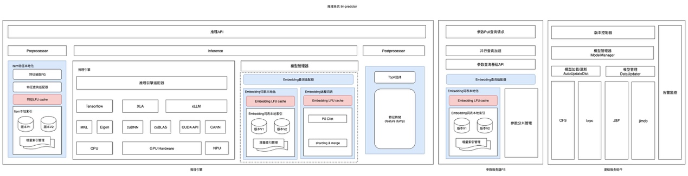
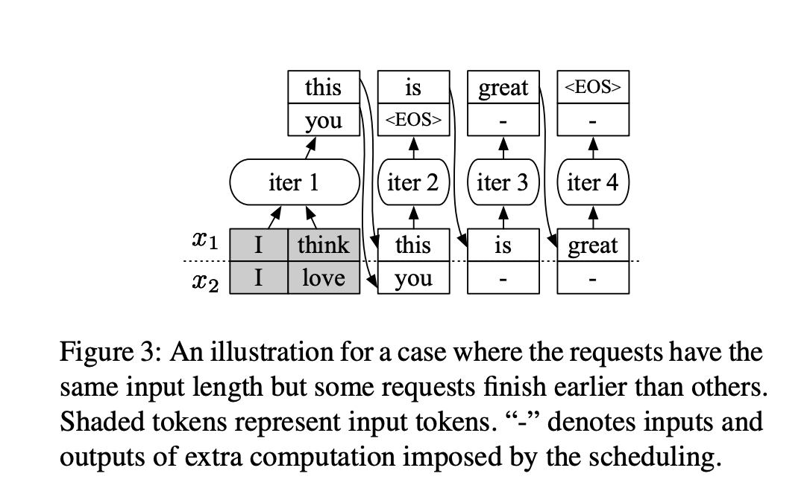
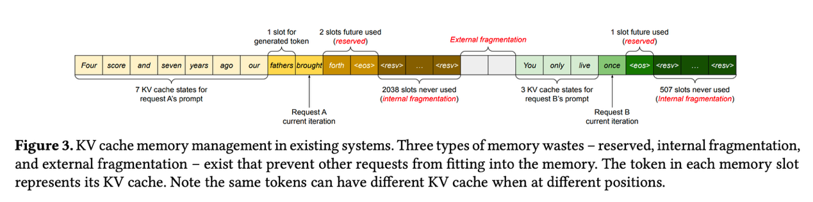
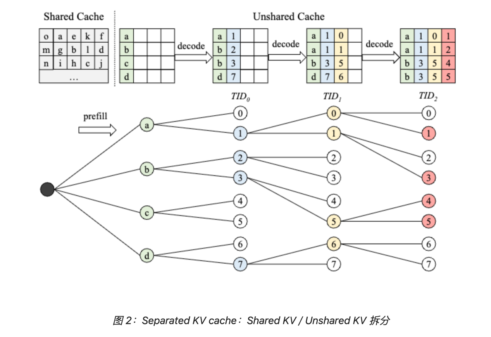
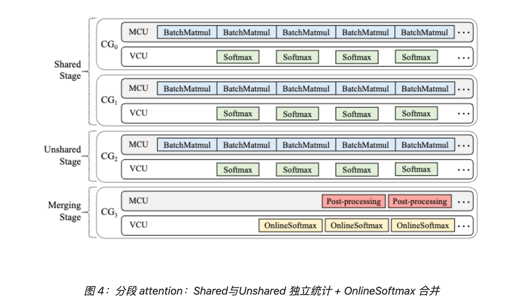

# 生成式推荐设计文档

## 概述

xLLM 在 `backend=rec` 场景下提供了生成式推荐推理能力。其目标不是替代现有推荐系统，而是在保留 `predictor` 侧稀疏特征处理和在线服务能力的前提下，把 LLM 主体推理能力复用到推荐场景中，用于候选扩展、候选比较和最终结果生成。

本文档重点说明以下内容：

- 生成式推荐场景的目标与约束
- 推荐模型结构与推理接入方式
- 为什么推荐场景更适合固定调度和整图执行
- `xAttention` 与 `beam search` 如何围绕显存和执行效率协同优化
- 当前分支中与生成式推荐相关的核心代码分布

本文档的设计目标包括：

- 用统一视角解释 `backend=rec` 的推理链路
- 说明固定调度、整图执行和定制算子之间的关系
- 为后续技术分享、代码走读和文档扩展提供稳定底稿

本文档的非目标包括：

- 不展开推荐模型训练细节
- 不覆盖所有线上业务接入差异
- 不替代各模块的详细 API 文档

## 1. 背景和问题

最近几年，基于 LLM 的生成式推荐取得了比较明显的进展。在 xLLM 中，我们也逐步补齐了对生成式推荐推理的支持。生成式推荐的目标，不是简单把大模型能力接进推荐系统，而是希望利用生成式建模能力，在候选扩展和排序阶段提升效果，尤其是提升 `CTR` 这类核心指标。

在当前方案中，我们使用自研 xLLM 作为统一推理引擎，通过动态库（`.so`）方式接入现有预测链路：

- `predictor` 侧继续负责稀疏特征处理、样本组织和在线服务集成；
- `xLLM` 侧负责完成 LLM 相关推理计算。

这样做的价值在于，推荐系统原有的工程能力可以保留，而 xLLM 在算子、KV Cache、多后端执行和调度上的基础设施也能够直接复用。

但生成式推荐和通用 LLM 推理，优化目标并不相同。

- 通用 LLM 推理更关注逐步生成的体验，例如尽快返回第一个结果、尽量缩短每一步生成之间的间隔，并允许请求在执行过程中灵活插入和提前结束；
- 生成式推荐更关注整次请求的总时延，以及在有限几轮内得到更优的候选结果。

原因很直接：推荐场景通常不是生成一段开放文本，而是在固定几轮里不断扩展候选、比较候选，最后输出更优结果。



这里经常会用到 `beam search`。可以把它理解为：在每一轮里，不只保留当前最优的一条路径，而是同时保留多个高分候选，并在后续轮次继续扩展和比较，最后从这些候选里选出更优结果。在推荐场景里，这样做的意义不是“生成更长内容”，而是“在有限几步内覆盖更多高质量候选，提高最终推荐效果”。



因此，生成式推荐天然有两个特征：

- 固定步数推进；
- 多个候选同步比较。

也就是说，这个场景真正要优化的，不是“某一条序列先跑完”，而是“多个候选在固定几轮里稳定推进，并在每一轮完成低开销比较”。这也决定了后续的设计方向：调度层更适合使用固定调度，执行层更适合做整图执行，并在稳定执行形态上做专门的算子优化。

## 2. 推理架构

### 2.1 模型结构介绍

生成式推荐是近两年推荐系统领域的重要方向。它正在打破传统“召回-排序-重排”的级联边界，把推荐任务从“判别式匹配”推进到“生成式预测”。当前文档里重点关注两类已经在线上大规模使用的模型：用于召回的 OneRec 模型，以及用于精排的 OneTrans 模型。





从这些模型的共同点来看，它们保留了传统 CTR 场景里的序列特征、用户静态特征和上下文特征，并由输入适配层把异构推荐信号（离散 ID、连续值、序列、多模态内容）统一映射为 LLM Decoder 可理解的嵌入表示（embedding），必要时再与 LLM 的词表嵌入空间对齐。模型主体则是 LLM 的 Encoder+Decoder 或 Decoder-only 结构，因此不同部分需要不同的推理引擎承接。

### 2.2 推理架构介绍

根据模型结构特点，当前方案把模型切成两类子图：

- 输入适配层仍然归属于传统 CTR 推理范畴，由 `predictor` 承接；
- LLM 主体部分由 xLLM 承接。

作为 LLM 推理的核心引擎，xLLM 在生成式推荐场景下提供了两种接入方式：RPC 接入与动态库（`.so`）接入。

#### 2.2.1 RPC 接入方式

当前营销等在线召回场景的生成式推荐主要采用 RPC 方式接入。它的优点是服务边界清晰、接入方式稳定，但也会引入额外的 RPC 调用开销。

#### 2.2.2 动态库接入方式

另一种方式是把 xLLM 作为 `predictor` 内部的独立推理引擎，对模型中属于 LLM 主体的子图直接做推理。这样可以省掉 RPC 往返开销，后续更适合承接需要低延迟的相关业务。



## 3. 固定调度与整图执行

### 3.1 固定步数调度



上图来自论文《Orca: A Distributed Serving System for Transformer-Based Generative Models》，它介绍了 `continuous batching` 的背景：通过动态重组 batch，避免固定 batch 调度导致算力空转。

但生成式推荐是固定步数的，这一点改变了调度问题本身。从调度角度看，生成式推荐更适合 `fixed_steps_scheduler`，而不是 `continuous batching`。原因不只是“固定步数所以固定调度”，而是因为这个场景本身就是按固定几轮来组织计算的。既然请求通常会在约定好的几步里完成，而且多个候选需要同步向前推进，那么调度器最重要的任务就不是“随时插队、随时清退”，而是“把这一组候选稳定地发出去，并尽量减少额外调度动作”。

`fixed_steps_scheduler` 的第一个好处，是更适合 `beam search`。在 `decode` 阶段，`beam width` 往往比较大，我们希望多个 beam 在同一轮里一起推进、一起比较。如果采用连续调度，那么每一步都可能触发 batch 重组、sequence 压缩、索引重排和状态裁剪。这些动作在通用 LLM 推理里是合理的，因为请求确实会动态结束；但在生成式推荐里，它们很多时候并不是收益，而是额外成本。使用固定调度之后，同一个请求下的多个 beam 可以在固定窗口里齐头并进，调度器不需要每一步都重新组织 batch，也不需要反复判断哪些序列该保留、哪些序列该剔除。这样做可以明显减少调度层的控制开销。

第二个好处，是执行形态会更稳定。一旦解码轮数固定、beam group 规模固定、推进节奏固定，很多后续优化才真正有了基础。比如 buffer 可以提前分配，workspace 更容易复用，cache 访问模式也更规整。对于性能优化来说，这种稳定性很重要，因为它意味着更容易做 profiling、更容易做容量规划，也更容易把执行链路固化下来。换句话说，`fixed_steps_scheduler` 解决的是调度稳定性问题，它让执行入口从动态、不规则、频繁变化的状态，收敛成了一个稳定的固定窗口。



第三个好处，是它减少了很多与模型计算无关的损耗。在推荐场景里，主要成本本来应该集中在真正的候选扩展、注意力计算和 beam 比较上；但如果每一步都让调度器参与 sequence 重排、batch 重组、元数据更新和索引搬运，那么会引入不少“不是算子本身、但又必须付出”的额外成本。从这个角度看，固定调度本质上是在用更强的执行确定性，换更高的吞吐、更低的调度成本以及更稳定的运行时行为。

当然，固定调度也有代价。最明显的问题就是，新请求的等待时间会变长。因为连续调度的一个优势，是新请求可能等一步就有机会被插入；而固定调度下，新请求通常要等当前这一轮固定窗口结束，才能进入下一轮执行。这会带来更明显的排队等待。这个问题的缓解方向，不是退回到连续调度，而是引入 `multi-stream`。也就是说，把已经在固定窗口里的大批请求和新接入的小批请求尽量解耦，让它们落在不同 stream 或不同执行通道上。这样做的目的，不是完全消除等待，而是在保住固定调度吞吐优势的同时，降低新请求接入的额外时延。

### 3.2 整图执行

在这个基础上，`multi_step_pipeline` 就成为固定调度的天然配套设计。它解决的是执行效率问题。既然我们已经知道这个场景本身就是固定几步，而且通常不会提前结束，那么就没有必要每一步都让 host 参与一次控制：没有必要每一步都做一次 `D2H` 去判断“这一批是不是结束了”，也没有必要每一步都再做一次 `H2D` 去准备下一轮输入。更高效的做法，是在第一步启动时，就把后续若干步需要用到的空间、索引和数据结构一次性准备好，然后让 device 侧连续向前推进。

这样做的收益非常直接：

- 减少 `D2H/H2D` 往返，降低 host 参与频率；
- 减少每一步的 launch 和控制开销；
- 让更多中间数据停留在 device 侧，提高数据复用效率；
- 让整段执行过程更像一条连续流水，而不是“每一步停一下、准备一下、再继续”。

对于生成式推荐这种固定轮数任务来说，这种连续执行方式明显比逐步回到 host 再下发下一轮更高效。

`multi_step_pipeline` 还有一个经常被低估的价值，就是它为定制算子创造了更好的运行条件。在执行形态稳定之后，配合定制算子把关键热路径进一步做快。`fixed step` 解决的是调度稳定性，而整图执行加上算子定制，解决的是执行效率。

## 4. 显存管理与算子协同优化

### 4.1 计算与显存瓶颈

#### 4.1.1 模型输入输出特征

在当前生成式推荐推理设定中，item id 由固定长度 token 序列表示，因此 `decode_step` 是已知的小常数（例如 3）。一次请求的推理流程可以概括为：

- 一次 prefill：输入为长序列，即用户历史上下文；
- `decode_step` 次 decode：每步生成 1 个 token，最终组合为 item id。

单步 decode 的单位开销并不低。为了召回与多样性，生成式推荐通常需要较大的 `beam_width`；同时每条 beam 还要扩展 `top_k` 个候选，再在全局候选池 `beam_width × top_k` 上选择新的 beam 集合，最终 beam 集合大小仍保持为 `beam_width`。例如当 `beam_width=512`、`top_k=512` 时，单步候选池大小达到 262144（约 2.6×10^5）。因此 decode 的步数虽然不多，但每步的搜索选择与 KV 访问开销仍然不低。

#### 4.1.2 存储冗余与显存碎片

生成式推荐推理服务的主要瓶颈可以拆成两类，而 `xAttention` 就是围绕这两类问题来设计的。

第一类是 Attention 的冗余带宽消耗：shared prefix 没有被显式建模为可复用结构。在较大的 beam 场景下，所有 beam 都共享同一段长 prompt，但通用实现往往以“每条 beam 一条完整序列”的视角组织 KV，导致 Shared KV 在 beam 维度被重复触发加载，attention kernel 的有效算术强度下降，最终受限于 HBM 带宽。

第二类是 KV Cache 的复制与碎片：beam 分叉与 block 级管理之间存在结构性冲突。beam search 会频繁 fork 与 retire，并触发 beam 重排。对于基于 block 的 KV 管理（例如 PagedAttention 一类），“重排 + block 对齐”往往意味着 block copy、碎片化以及额外空间浪费，显存和带宽都会被放大。

### 4.2 `xAttention` 设计原理

#### 4.2.1 KV Cache 存储优化



围绕当前生成式推荐推理的固定结构，xAttention 把 KV Cache 的组织方式与 attention 计算和并行策略一起重新设计，将 shared prefix 在显存层面只存一份，同时 beam 的分叉与重排不再触发高代价的数据拷贝。

首先，KV Cache 被按“是否共享前缀”拆成两类：

- **Shared KV**：prefill 阶段生成的 prompt KV，所有 beam 共享同一份物理存储；
- **Unshared KV**：decode 阶段每条 beam 新生成 token 的 KV，按 token 粒度管理。

拆成两类 KV 之后，Unshared KV 只存储 decode 阶段产生的新 token，从而避免 block copy 与显存浪费。

#### 4.2.2 Attention 计算优化



为了避免把 Shared 与 Unshared KV 直接拼接成一个逻辑长序列，以及由此带来的访存与拷贝问题，xAttention 把一次 attention 拆成三个阶段：

1. **shared stage**：仅对 Shared KV 计算局部 softmax 统计量与部分输出；
2. **unshared stage**：仅对 Unshared KV 计算局部统计量与部分输出；
3. **merge stage**：使用 OnlineSoftmax 把两段结果稳定合并。

并行化层面，会把 shared、unshared 与 merge 分配到不同执行单元和队列中形成流水线，目标是让 Shared 与 Unshared 的计算尽量重叠执行，同时把同步点压缩到最少。

## 5. 代码结构

当前分支里，生成式推荐相关代码可以按下面的结构理解：

外部接入：
- `xllm/c_api/rec.h`
- `xllm/c_api/internal/rec.cpp`
- `xllm/c_api/examples/simple_rec_completions.cpp`

服务入口：
- `xllm/api_service/rec_completion_service_impl.cpp`
- `xllm/api_service/chat_service_impl.cpp`
- `xllm/api_service/api_service.cpp`
- `xllm/api_service/api_service.h`

调度与引擎：
- `xllm/core/distributed_runtime/rec_master.cpp`
- `xllm/core/distributed_runtime/rec_master.h`
- `xllm/core/scheduler/fixed_steps_scheduler.cpp`
- `xllm/core/scheduler/fixed_steps_scheduler.h`
- `xllm/core/distributed_runtime/rec_engine.cpp`
- `xllm/core/distributed_runtime/rec_engine.h`

batch / request / proto：
- `xllm/core/framework/batch/rec_batch_input_builder.cpp`
- `xllm/core/framework/batch/rec_batch_input_builder.h`
- `xllm/core/framework/batch/rec_multi_round_batch_input_builder.cpp`
- `xllm/core/framework/batch/rec_multi_round_batch_input_builder.h`
- `xllm/core/framework/request/rec_type.h`
- `xllm/proto/rec.proto`
- `xllm/proto/completion.proto`
- `xllm/proto/xllm_service.proto`

runtime / worker：
- `xllm/core/runtime/rec_worker_impl.cpp`
- `xllm/core/runtime/rec_worker_impl.h`

kernel / 算子热路径：
- `xllm/core/layers/cuda/xattention.cpp`
- `xllm/core/layers/cuda/flashinfer_attention.cpp`
- `xllm/core/kernels/cuda/xattention/beam_search.cpp`
- `xllm/core/kernels/cuda/xattention/cache_select.cu`

## 6. 当前分支的执行主链

为了把设计和实现真正对起来，可以把当前分支的主执行链拆成下面几步来理解：

1. **外部接入**
   - 如果走动态库方式，请求会从 `xllm/c_api/internal/rec.cpp` 中的 `xllm_rec_text_completions`、`xllm_rec_token_completions` 或 `xllm_rec_chat_completions` 进入。
   - 如果走服务方式，请求会从 `xllm/api_service/rec_completion_service_impl.cpp` 或 `chat_service_impl.cpp` 进入，再转到 `RecMaster`。

2. **请求进入 `RecMaster`**
   - `RecMaster` 负责把 prompt、token ids、raw embedding 等不同入口统一收敛到 request 构造逻辑。
   - 在这里会根据模型类型区分 `kOneRec` 和 `kLlmRec`，并选择不同的 request pipeline。

3. **进入固定调度**
   - `RecMaster` 在初始化时直接创建 `FixedStepsScheduler`。
   - 调度器不再按“每一步都动态重排 batch”的思路工作，而是优先围绕固定轮数和固定候选组去构造 batch。

4. **引擎执行**
   - `RecEngine` 再根据 `RecPipelineType` 选择执行路径。
   - 对 `LlmRec` multi-round 场景，会下沉到 `RecMultiRoundEnginePipeline`，把多轮 decode 的主要控制逻辑继续往 worker 侧下压。

5. **batch 与输入拼装**
   - `RecBatchInputBuilder` 和 `RecMultiRoundBatchInputBuilder` 负责把 sequence、step 信息、decode positions、sampling params 等整理成 `ForwardInput`。
   - 这里的 `step_meta` 是 multi-step 执行的关键数据来源，它决定后续每一轮 decode 该如何构造位置、cache 和 beam 相关输入。

6. **worker 侧多轮执行**
   - `RecWorkerImpl::LlmRecMultiRoundPipeline::step()` 会在设备侧循环多轮。
   - 它会先准备 beam search tensor、full/unshared KV 相关结构，再在每一轮中执行：
     - 当前轮输入准备
     - 模型 forward
     - sample 输出处理
     - beam search
     - cache select
     - 下一轮输入预计算

7. **算子热路径**
   - Attention 相关路径落在 `xattention.cpp` 与 `flashinfer_attention.cpp`
   - beam 相关路径落在 `beam_search.cpp`
   - beam 重排后的 cache 选择路径落在 `cache_select.cu`

如果从技术分享视角来讲，这条主链非常适合作为“架构总图”之后的第一条展开线，因为它把“固定调度、整图执行、定制算子”三件事串成了一个具体执行过程，而不是三个割裂的优化点。

## 7. 设计取舍与适用边界

这套设计并不意味着固定调度一定优于连续调度，也不意味着 multi-step pipeline 适合所有生成任务。它成立的前提，是当前生成式推荐场景具有下面几个特征：

- decode 轮数较固定，通常不会像开放式文本生成那样提前结束；
- 同一请求下存在较大的 `beam_width`，而且多个 beam 需要同步比较；
- 整次请求的总时延，比逐 token 的交互体验更重要；
- 设备侧状态（KV Cache、positions、beam tensors）可以提前组织并稳定复用。

在这些前提成立时，固定调度和整图执行的收益会比较明显。但它也有明确边界：

### 7.1 固定调度的边界

- 如果请求长度差异极大，而且大量请求会提前结束，那么连续调度的灵活性会更有价值；
- 如果业务更关心“新请求能不能立刻插入”，而不是“当前窗口吞吐是否最优”，固定调度会天然吃亏；
- 如果候选扩展不依赖大规模 beam 同步推进，那么固定窗口的收益会下降。

### 7.2 multi-step pipeline 的边界

- 如果每一步都必须回到 host 做强控制决策，那么 multi-step pipeline 的优势会被削弱；
- 如果 shape、batch 或关键输入在每一轮都大幅波动，那么想要把多轮执行稳定下来会更难；
- 如果后端算子本身还不支持稳定的多轮设备侧推进，那么整图执行只会停留在概念层。

### 7.3 定制算子的边界

`xAttention` 和 `beam search` 定制算子之所以值得做，是因为当前执行形态已经足够稳定。如果没有 fixed-step 带来的稳定 batch 形态，也没有 multi-step pipeline 带来的稳定多轮推进，那么很多定制优化都会被反复的数据搬运、batch 重组和 host 参与开销抵消掉。

因此，更合理的理解顺序不是“先有定制算子，再决定调度”，而是：

1. 先确认 workload 适合固定调度；
2. 再确认多轮执行可以尽可能下沉到设备侧；
3. 最后再围绕真正稳定下来的热路径做算子定制。

这样才能让 `fixed_steps_scheduler`、`multi_step_pipeline`、`xAttention` 和 `beam search` 四者形成一套前后自洽的设计，而不是彼此孤立的优化点。

## 8. 代码路径附录

这一节的目的，不是重复“代码结构”里的文件清单，而是给读者一个更可执行的阅读顺序：如果后续要继续做技术分享、走读代码，或者排查 `backend=rec` 路径上的行为差异，可以直接按下面的顺序进入。

### 8.1 从外部入口开始看

如果要理解 `predictor` 或动态库接入是怎样进入 xLLM 的，建议先看下面几处：

- `xllm/c_api/rec.h`
  - 对外暴露 `xllm_rec_create`、`xllm_rec_initialize`、`xllm_rec_text_completions`、`xllm_rec_token_completions`、`xllm_rec_chat_completions`
  - 适合先理解“外部系统到底能怎么调用 REC 能力”
- `xllm/c_api/internal/rec.cpp`
  - 这是真正的 CAPI 实现
  - 适合看 `.so` 模式下，request 参数是怎样被封装和转发的
- `xllm/c_api/examples/simple_rec_completions.cpp`
  - 是最短的调用示例
  - 如果要给新人解释“动态库接入长什么样”，这里最直观

如果技术分享里想给一段“最小调用样例”，这一层最适合出现在开头。

### 8.2 从服务入口看统一分发

如果你更关心 RPC 或统一服务链路，可以继续看：

- `xllm/api_service/api_service.cpp`
  - 这里会根据 `FLAGS_backend` 决定挂哪类 service impl
  - `backend == "rec"` 时，`rec_completion_service_impl_` 和 `chat_service_impl_` 都会被接上
- `xllm/api_service/rec_completion_service_impl.cpp`
  - 负责把 rec completion 请求转给 `RecMaster`
  - `routing`、`input_tensors`、`RequestParams` 都是在这里被整理进来
- `xllm/api_service/chat_service_impl.cpp`
  - 对 `RecMaster` 也有 chat 入口
  - 适合说明“REC 不是只有 token completion，一样可以走 chat 形态”

这一层适合在技术分享中回答一个问题：为什么说 `backend=rec` 不是另起炉灶，而是接进了现有服务框架。

### 8.3 从调度和引擎看主链

如果分享的重点是“为什么 fixed step 更适合 rec”，阅读顺序建议是：

1. `xllm/core/distributed_runtime/rec_master.h`
2. `xllm/core/distributed_runtime/rec_master.cpp`
3. `xllm/core/scheduler/fixed_steps_scheduler.h`
4. `xllm/core/scheduler/fixed_steps_scheduler.cpp`
5. `xllm/core/distributed_runtime/rec_engine.h`
6. `xllm/core/distributed_runtime/rec_engine.cpp`

可以按下面这条链理解：

```text
Rec request
  -> RecMaster
  -> FixedStepsScheduler
  -> RecEngine
  -> RecEnginePipeline
  -> Worker / worker_clients
```

这里最值得讲的几个点是：

- `RecMaster` 负责入口收敛和 pipeline 选择
- `FixedStepsScheduler` 负责把 request 组织成适合固定轮数推进的 batch
- `RecEngine` 负责把调度结果交给实际执行路径
- `RecMultiRoundEnginePipeline` 代表“多轮 decode 控制进一步下沉”的实现方式

如果分享时要强调“fixed step 不是口头概念，而是代码主链的真实选择”，这一层就是核心证据。

### 8.4 从 batch builder 看 multi-step 的输入组织

如果要解释 `multi_step_pipeline` 为什么能成立，单看 scheduler 还不够，必须继续看 batch builder：

- `xllm/core/framework/batch/rec_batch_input_builder.h`
- `xllm/core/framework/batch/rec_batch_input_builder.cpp`
- `xllm/core/framework/batch/rec_multi_round_batch_input_builder.h`
- `xllm/core/framework/batch/rec_multi_round_batch_input_builder.cpp`
- `xllm/core/framework/batch/batch.cpp`

这里最重要的不是“类名”，而是几个关键事实：

- `RecBatchInputBuilder::create(...)` 会按 `RecType` 和 multi-round 模式选择 builder
- `RecMultiRoundBatchInputBuilder` 不是普通 builder 的轻微变种，而是专门为多轮 decode 组织输入的实现
- `step_meta`、`decode_positions`、`sampling params`、`batch forward type` 等信息是在这一层被拼好并送往后续 runtime 的

所以，如果要说明“为什么第一步就能把后面几步的输入准备好”，这一层比只讲 engine 更关键。

### 8.5 从 worker 看 device 侧多轮执行

`multi_step_pipeline` 真正最值得展开的代码在：

- `xllm/core/runtime/rec_worker_impl.h`
- `xllm/core/runtime/rec_worker_impl.cpp`

尤其是下面这些点：

- `RecWorkerImpl::step_async(...)`
  - 说明请求是如何进到 worker 内部并在特定 stream 上执行的
- `RecWorkerImpl::LlmRecMultiRoundPipeline::prepare_inputs(...)`
  - 说明 multi-round 输入如何进入 runtime
- `RecWorkerImpl::LlmRecMultiRoundPipeline::allocate_kv_caches_related()`
  - 说明为什么 fixed-step 场景更适合提前分配 KV 相关结构
- `RecWorkerImpl::LlmRecMultiRoundPipeline::step(...)`
  - 这是最核心的一段
  - 明确展示了多轮循环、beam search、cache select、下一轮输入预计算之间的关系
- `compute_next_round_input_async(...)`
  - 这是解释“为什么可以减少 host 往返”的关键点

如果技术分享想从“执行效率”而不是“调度策略”切入，这一层是最值得重点展开的。

### 8.6 从 kernel 热路径看为什么定制算子值得做

如果要讲 `xAttention` 和 `beam search` 定制算子，推荐按下面的顺序进：

- `xllm/core/layers/cuda/xattention.cpp`
- `xllm/core/layers/cuda/flashinfer_attention.cpp`
- `xllm/core/kernels/cuda/xattention/xattention_ops_api.h`
- `xllm/core/kernels/cuda/xattention/beam_search.cpp`
- `xllm/core/kernels/cuda/xattention/cache_select.cu`

这一层适合回答 3 个问题：

1. Attention 的稳定执行路径到底落在哪
2. Beam Search 为什么不只是调度问题，而是 kernel 热路径问题
3. beam 重排之后的 cache select 为什么必须和前面的执行形态一起考虑

也就是说，技术分享如果要把 `fixed_steps_scheduler`、`multi_step_pipeline`、`xAttention` 和 `beam search` 串成一条线，最终一定会落到这里。

### 8.7 推荐的代码阅读顺序

如果后续你或者其他同学还要继续扩写这篇文档，我建议代码阅读顺序固定成下面这样：

```text
入口
  -> api_service
  -> RecMaster
  -> FixedStepsScheduler
  -> RecEngine
  -> RecBatchInputBuilder / RecMultiRoundBatchInputBuilder
  -> RecWorkerImpl::LlmRecMultiRoundPipeline
  -> xAttention / beam_search / cache_select
```

这个顺序的好处是：

- 先看“请求怎么进来”
- 再看“为什么 fixed step”
- 再看“multi-step 是怎么在设备侧成立的”
- 最后看“定制算子为什么在这里有价值”

这样逻辑最顺，也最适合技术分享展开。

## 9. 关键代码锚点索引

如果后续需要继续写技术分享、补代码注释，或者在评审时快速证明文档里的说法来自当前分支实现，可以直接从下面这组锚点入手。

### 9.1 入口与服务层锚点

- `xllm/core/distributed_runtime/rec_master.cpp:575`
  - `RecMaster::handle_request(...)`
  - 对应 prompt / prompt_tokens / input_tensors 入口
- `xllm/core/distributed_runtime/rec_master.cpp:603`
  - `RecMaster::handle_request(...)`
  - 对应 chat messages 入口
- `xllm/core/distributed_runtime/rec_master.cpp:651`
  - `RecMaster::handle_request(const std::vector<int>& prompt_tokens, ...)`
  - 对应 token / raw input 类入口

这些锚点适合回答一个问题：REC 请求到底是怎么被收敛到 `RecMaster` 里的。

### 9.2 调度层锚点

- `xllm/core/scheduler/fixed_steps_scheduler.cpp:337`
  - `FixedStepsScheduler::step(const absl::Duration& timeout)`
  - 这是 fixed-step 调度真正往前推进的一步
- `xllm/core/scheduler/fixed_steps_scheduler.cpp:186`
  - `FixedStepsScheduler::prepare_batch()`
  - 适合解释当前 batch 是怎么在固定步场景下被组织的
- `xllm/core/framework/batch/rec_batch_input_builder.cpp:29`
  - `RecBatchInputBuilder::create(...)`
  - 适合解释 builder 是如何按 `RecType` 和 multi-round 模式切换的

这几处放在一起，可以直接支持“fixed_steps_scheduler 不是概念，而是代码主链里的真实选择”这一点。

### 9.3 引擎与多轮执行锚点

- `xllm/core/distributed_runtime/rec_engine.cpp:901`
  - `RecEngine::RecMultiRoundEnginePipeline::step(...)`
  - 说明 engine 层如何把执行进一步下沉到 multi-round pipeline
- `xllm/core/runtime/rec_worker_impl.cpp:849`
  - `RecWorkerImpl::LlmRecMultiRoundPipeline::step(...)`
  - 这是最关键的一段，真正体现多轮 decode 循环在设备侧发生
- `xllm/core/runtime/rec_worker_impl.cpp:1011`
  - `xllm::kernel::cuda::beam_search(...)` 调用点
- `xllm/core/runtime/rec_worker_impl.cpp:1066`
  - `xllm::kernel::cuda::cache_select(...)` 调用点

如果你需要在分享中明确“beam search 和 cache select 不是调度层概念，而是直接落到 device 热路径上的实现”，这一组锚点最适合引用。

### 9.4 这组锚点怎么用

这组锚点不需要在正文中全部展开，但非常适合作为：

- 技术分享讲稿里的“代码证据页”
- PR 说明里的“关键实现位置”
- 后续 reviewer 问“这句话代码在哪”的快速答复

如果后续还要继续扩写文档，建议优先围绕这几处函数补更细的输入输出说明，而不是再扩展泛化描述。

## 10. 推荐讲解顺序与阅读策略

前面的“代码路径附录”和“关键代码锚点索引”更像是资料库，适合在需要时回查；但如果这篇文档要真正变成一场技术分享的底稿，还需要一条更偏“讲述顺序”的线索。下面给出一个更适合对外讲的展开顺序。

### 10.1 推荐的讲解顺序

如果听众并不直接参与 `backend=rec` 的实现，建议不要一上来就讲 `RecWorkerImpl` 或 `beam_search.cpp`，而是按下面的顺序推进：

1. **先讲业务目标**
   - 为什么生成式推荐和通用 LLM 推理的目标不一样
   - 为什么这里更关注“整次请求的总时延”和“固定几轮的候选比较”

2. **再讲调度选择**
   - 为什么 `fixed_steps_scheduler` 更适合这个 workload
   - 为什么大 `beam_width` 会让固定调度比连续调度更划算

3. **然后讲执行方式**
   - `multi_step_pipeline` 为什么可以把多轮 decode 控制下沉到设备侧
   - 为什么这样可以减少 host 往返和控制开销

4. **再讲定制算子**
   - 为什么执行形态稳定之后，`xAttention` 和 `beam search` 优化才真正值得做
   - 为什么这两类优化要放在一节里讲，而不是拆成孤立话题

5. **最后回到代码**
   - 再用代码主链和锚点证明前面的结论，不让整场分享停留在概念层

这个顺序的好处是：听众先理解“为什么”，再理解“怎么做”，最后再看“代码在哪里”。这比一开始就从实现文件名切入更容易跟上。

### 10.2 如果是内部走读，顺序可以反过来

如果听众本身就是 xLLM 或推荐基础设施相关同学，那么也可以采用另一条顺序：

1. 先看 `RecMaster -> FixedStepsScheduler -> RecEngine`
2. 再看 `RecBatchInputBuilder`
3. 再看 `RecWorkerImpl::LlmRecMultiRoundPipeline`
4. 最后看 `xAttention / beam_search / cache_select`

这种讲法更适合代码走读，因为它直接沿着调用栈往下走。但它的缺点是，对没有上下文的听众来说，一开始就会掉进实现细节里，不容易先抓住设计选择背后的动机。

### 10.3 建议在分享中强调的 3 个结论

如果后续要把这篇文档压缩成 10 分钟技术分享，我建议把整篇内容收束成下面 3 句话：

- `fixed_steps_scheduler` 解决的是调度稳定性问题；
- `multi_step_pipeline` 解决的是多轮执行效率问题；
- `xAttention` 和 `beam search` 定制算子是在执行形态稳定之后，进一步兑现性能收益的关键路径优化。

这三句话是整篇文档最值得被记住的部分，后面的代码链路和锚点都可以理解为是在为这三句结论提供证据。

## 11. 与通用 LLM 推理路径的对照

为了避免把 `backend=rec` 看成“只是把 LLM 推理拿来改一改”，这里把它和通用 LLM 推理的主路径做一个更明确的对照。

### 11.1 优化目标不同

通用 LLM 推理更强调逐 token 的生成体验，例如尽快返回第一个结果、尽量缩短 token 间隔，并让新的请求尽快插入执行。  
而 `backend=rec` 更强调固定轮数内的候选扩展与比较，因此更关注整次请求的总时延，而不是单条序列的最早结束时间。

这意味着两者虽然都在做 decode，但优化目标已经发生了偏移：

- 通用 LLM 推理更偏“动态请求管理”
- 生成式推荐更偏“固定窗口内的同步推进”

### 11.2 调度重点不同

在通用 LLM 推理里，连续调度的价值来自于：

- 某些序列提前结束后可以立刻让位；
- batch 可以被持续重组；
- decode 路径中动态插入和动态退出是高频动作。

而在 `backend=rec` 里：

- decode 轮数更固定；
- `beam_width` 更大；
- 同一个 request 的多个候选需要在同一步比较；
- 频繁重排 batch 反而会放大调度成本。

所以，通用 LLM 推理的调度器重点是“灵活”，而生成式推荐的调度器重点是“稳定”。

### 11.3 执行方式不同

通用 LLM 推理常常允许 host 在每一步都继续参与调度、结束判断和下一轮输入准备。  
而生成式推荐因为轮数固定、候选同步推进，所以更适合在第一步时就把后续几步所需的结构准备好，再让 device 侧连续推进。

这也是为什么 `multi_step_pipeline` 对推荐场景更有价值：它不是简单减少几个 memcpy，而是把原本“每一步都回来问一下 host”的控制模式，替换成“尽量在设备侧连续完成多轮”的模式。

### 11.4 算子收益兑现方式不同

通用 LLM 推理里，算子优化往往直接服务于单步 decode 或通用 attention 路径。  
而在 `backend=rec` 中，算子优化的价值高度依赖执行形态是否已经稳定下来。

如果固定调度没有成立，batch 还在频繁重组；如果 multi-step pipeline 没有成立，host 还在反复介入，那么很多算子级优化都会被额外的数据搬运和控制开销抵消掉。  
因此，在推荐场景里更合理的顺序是：

1. 先把调度稳定下来；
2. 再把多轮执行尽量下沉到设备侧；
3. 最后才围绕真正稳定的热路径做 `xAttention`、`beam search`、`cache_select` 这类优化。

### 11.5 为什么这个对照值得单独写出来

这节的价值不在于“证明推荐和通用 LLM 不一样”，而在于帮助后续 reviewer、分享听众或者代码阅读者快速判断：

- 哪些设计是通用路径也会有的
- 哪些设计是 `backend=rec` 的特殊性逼出来的
- 哪些优化只有在推荐这个固定轮数场景里才成立

如果没有这节对照，很容易把 `fixed_steps_scheduler`、`multi_step_pipeline`、`xAttention` 和 `beam search` 误读成四个彼此独立的小优化；而实际上，它们是一套围绕推荐 workload 特征逐层收敛出来的组合设计。

## 12. 验证

建议在合入前至少完成以下检查：

- 中文与英文设计文档都能被正常渲染；
- 两份文档中的图片引用都能解析到 `docs/assets/` 下的实际文件；
- 英文文档引用的是英文版示意图，而不是带中文标注的原图；
- 首页或相关概览页已经能导航到这篇设计文档。
